# Activity Diagram — Hayu Ngaksara Sunda
## Bab 4 Skripsi · PlantUML Source + Deskripsi Langkah

> Render di: https://www.plantuml.com/plantuml/uml/  
> Atau gunakan plugin PlantUML di VS Code / IntelliJ

---

## AD-01 — Alur Sistem Keseluruhan (System Overview)

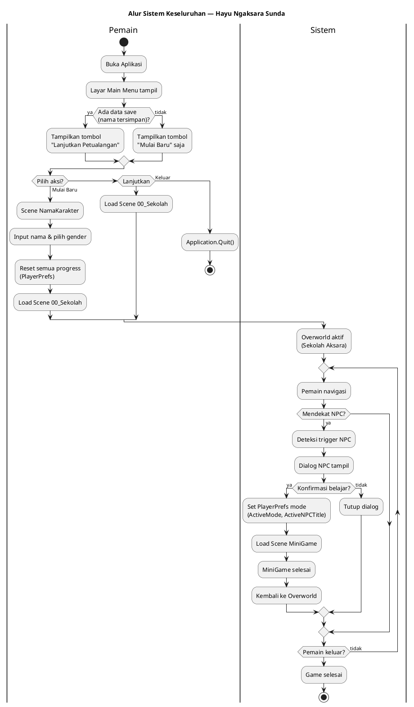

### Deskripsi Langkah AD-01

| # | Aktor | Aksi | Output |
|---|-------|------|--------|
| 1 | Pemain | Membuka aplikasi | Main Menu tampil |
| 2 | Sistem | Cek PlayerPrefs "PlayerName" | Tombol Lanjutkan aktif/hidden |
| 3 | Pemain | Pilih Mulai Baru / Lanjutkan / Keluar | Scene change |
| 4 | Sistem | Load `00a_NamaKarakter` (baru) atau `00_Sekolah` (lanjut) | Scene transition |
| 5 | Sistem | Overworld aktif, player spawn | Player dapat bergerak |
| 6 | Sistem | Deteksi jarak Player–NPC (OnTriggerEnter2D) | Dialog NPC tampil |
| 7 | Pemain | Konfirmasi interaksi | MiniGame scene di-load |
| 8 | Sistem | MiniGame selesai → CompleteChapter/SubActivity | Progress tersimpan |
| 9 | Sistem | Kembali ke Overworld | Loop berlanjut |

---

## AD-02 — Registrasi Pemain (Nama & Gender)

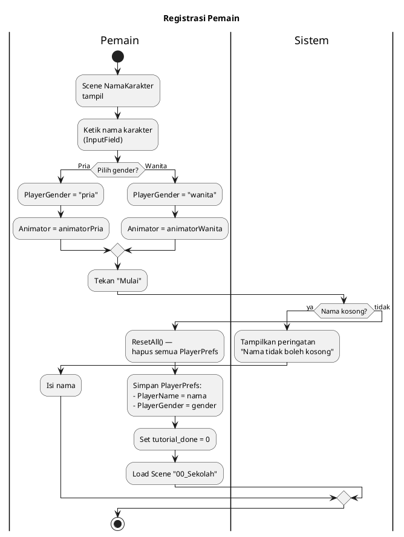

### Deskripsi Langkah AD-02

| # | Aksi | Komponen | Keterangan |
|---|------|----------|-----------|
| 1 | Input nama | NameInputController.InputField | Nama bebas, maks 20 karakter |
| 2 | Pilih gender | NameInputController.btnPria / btnWanita | Default: Pria |
| 3 | Validasi nama | NameInputController.OnMulai() | IsNullOrEmpty check |
| 4 | Reset progress | ChapterManager.ResetAll() | Hapus semua key ch_*_unlock |
| 5 | Simpan data | PlayerPrefs.SetString("PlayerName") | Persisten di device |
| 6 | Load Overworld | SceneManager.LoadScene("00_Sekolah") | Transition ke game |

---

## AD-03 — Navigasi Overworld & Interaksi NPC

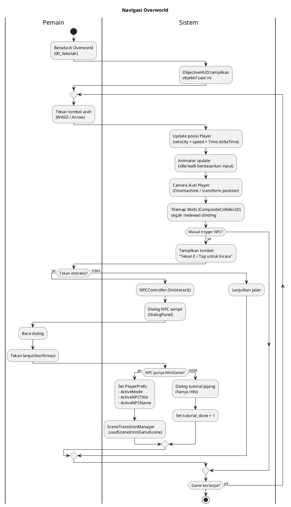

---

## AD-04 — Panel Belajar Aksara (Learn Panel)

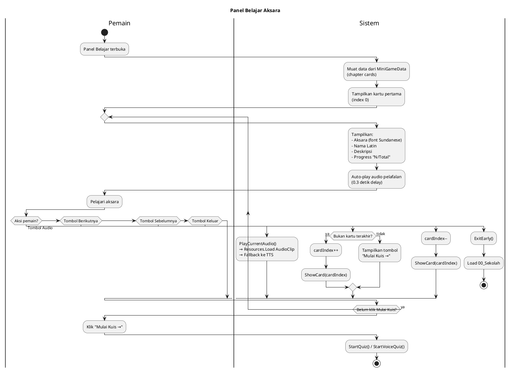

---

## AD-05 — Latihan Menulis / Trace Panel (+ Algoritma Q$)

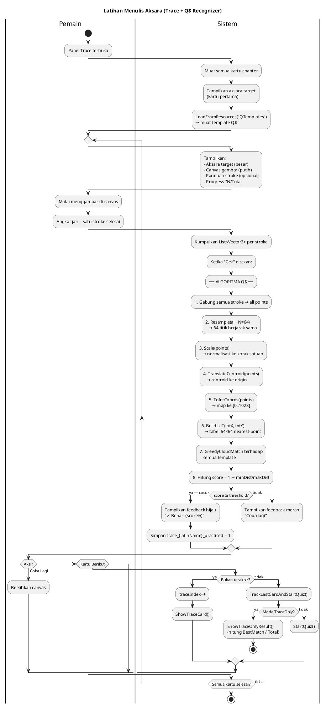

---

## AD-06 — Panel Kuis Normal (Aksara → Nama Latin)

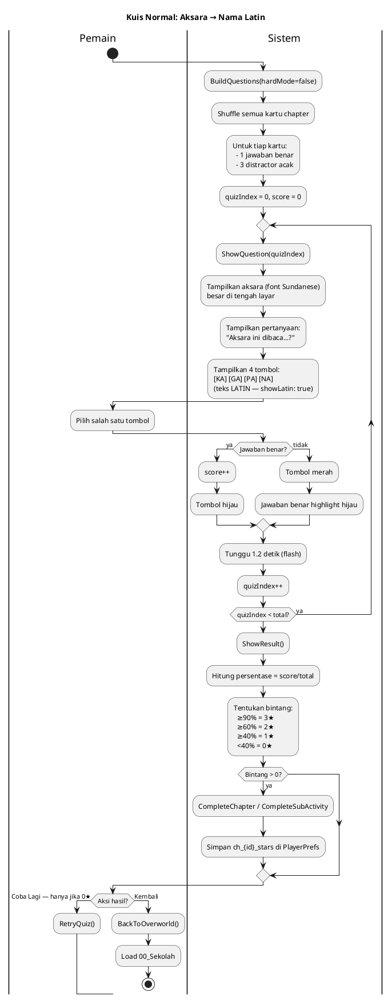

---

## AD-07 — Panel Kuis Hard Mode / Refleksi (Normal + Reverse)

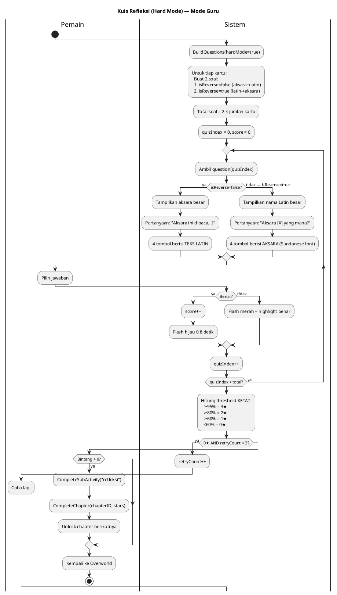

---

## AD-08 — Panel Pelafalan / Voice Quiz

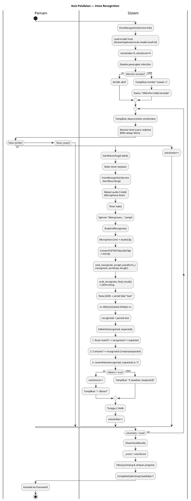

---

## AD-09 — Panel Gabung Aksara (Ujian Final — Andre)

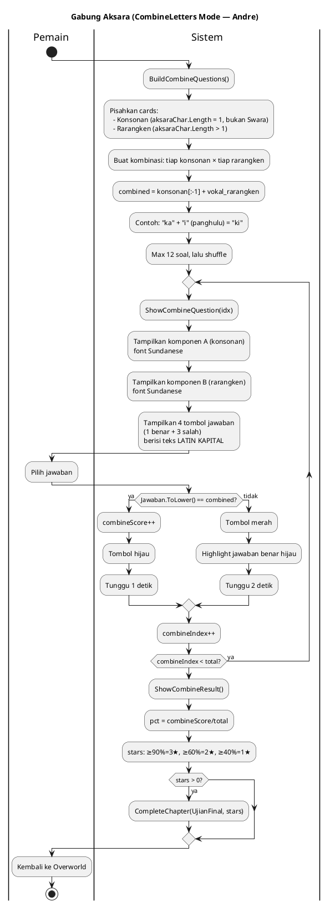

---

## AD-10 — Sistem Progres & Chapter Unlock

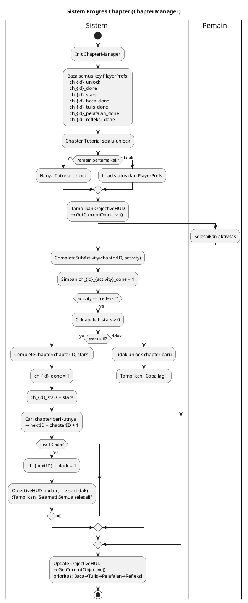

---

## AD-11 — Algoritma $Q Super-Quick Recognizer (Detail)

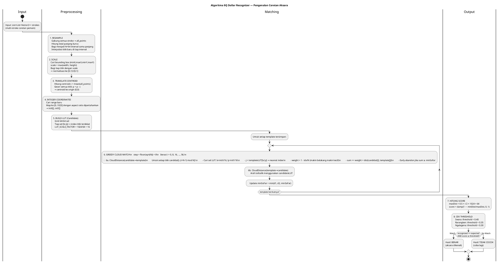

---

## AD-12 — Algoritma Voice Recognition Pipeline

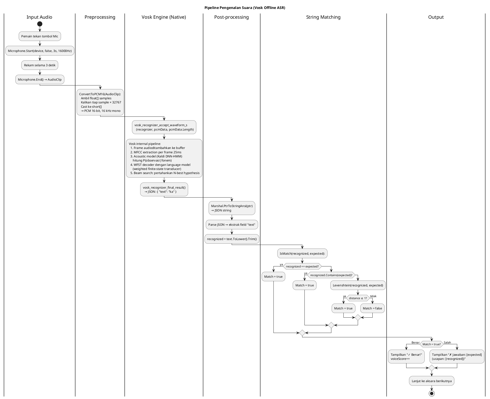

---

## Ringkasan Diagram & Keterkaitan

| Kode | Nama Diagram | Scene/File Terkait | Aktor |
|------|-------------|-------------------|-------|
| AD-01 | Sistem Keseluruhan | Semua scene | Pemain, Sistem |
| AD-02 | Registrasi | `00a_NamaKarakter` | Pemain, Sistem |
| AD-03 | Navigasi Overworld | `00_Sekolah` | Pemain, Sistem |
| AD-04 | Belajar Aksara | `MiniGameManager.ShowCard()` | Pemain, Sistem |
| AD-05 | Latihan Menulis | `TracePanel`, `QDollarRecognizer` | Pemain, Sistem |
| AD-06 | Kuis Normal | `MiniGameManager.ShowQuestion()` | Pemain, Sistem |
| AD-07 | Kuis Hard/Refleksi | `MiniGameManager.BuildQuestions(true)` | Pemain, Sistem |
| AD-08 | Kuis Pelafalan | `VoiceQuizPanel`, `VoiceRecognitionService` | Pemain, Sistem, Mic |
| AD-09 | Gabung Aksara | `MiniGameManager.StartCombine()` | Pemain, Sistem |
| AD-10 | Progres Chapter | `ChapterManager` | Sistem, DB |
| AD-11 | Algoritma Q$ | `QDollarRecognizer.cs` | Sistem |
| AD-12 | Algoritma Voice | `VoiceRecognitionService.cs`, `VoiceQuizPanel.cs` | Sistem |
