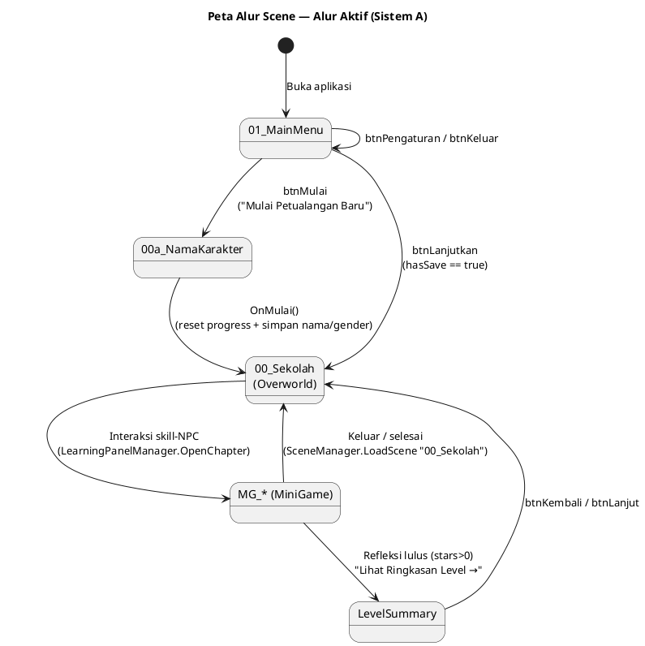
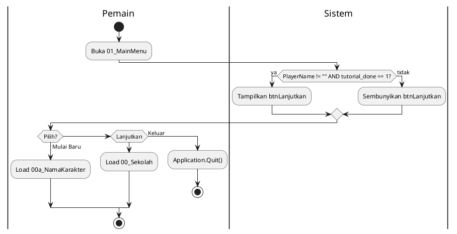
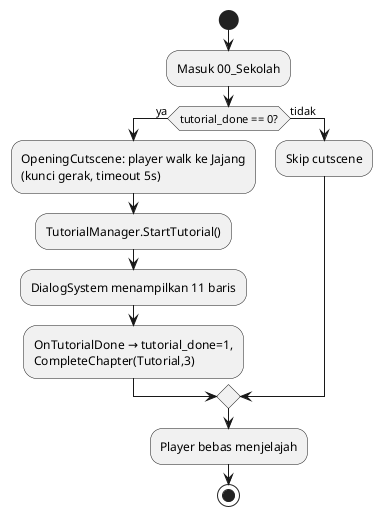
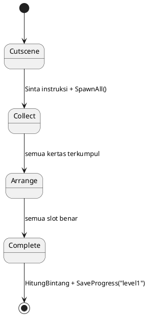
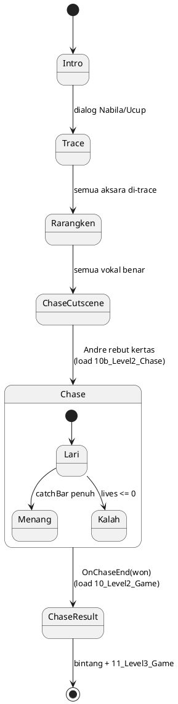
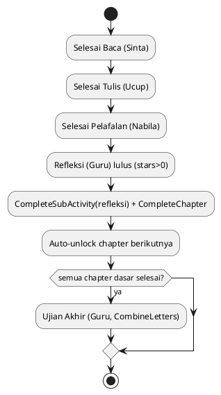
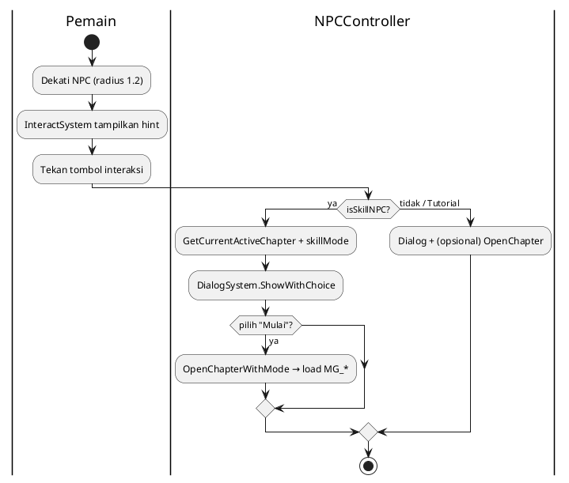

# Story, Level & Arsitektur Sistem — Hayu Ngaksara Sunda

> Dokumentasi teknis untuk Bab IV skripsi. **Semua isi diambil langsung dari kode
> nyata** di `Assets/_Game/Scripts/` (bukan asumsi). Bagian yang belum
> diimplementasikan ditandai **BELUM ADA**.
> Format mengikuti `Docs/ACTIVITY_DIAGRAMS.md` (PlantUML `@startuml…@enduml` +
> tabel `Aktor | Aksi | Output`).
>
> Konfirmasi build: **Build target aktif = `StandaloneWindows64`** (group
> `Standalone`), diverifikasi via `EditorUserBuildSettings.activeBuildTarget`.

---

## 0. Ringkasan Dua Sistem Level (PENTING)

Proyek memiliki **dua alur pembelajaran yang berbeda**. Hanya satu yang aktif di
build sekarang.

| Sistem | Scene | Manajer | Status |
|--------|-------|---------|--------|
| **A. MiniGame (AKTIF)** | `MG_Swara`, `MG_Ngalagena1`, `MG_Ngalagena2`, `MG_Rarangken`, `MG_UjianFinal`, `LevelSummary` | `MiniGameManager` | **Dipakai.** Terdaftar di Build Settings & dipanggil `LearningPanelManager.OpenChapter()` |
| **B. Level Naratif (LEGACY/PROTOTIPE)** | `07_Level1_Cutscene`, `08_Level1_Game`, `10_Level2_Game`, `10b_Level2_Chase`, `11_Level3_Game` | `Level1GameManager`, `Level2GameManager`, `ChaseManager`, `PelafalanGameManager` | **TIDAK terdaftar di Build Settings.** Kodenya lengkap tetapi tidak tersambung ke alur menu utama |
| **C. Scene aktivitas lama (LEGACY)** | `02_BelajarHuruf`, `03_LatihanBaca`, `04_LatihanTulis`, `05_Pelafalan`, `06_Kuis` | — | Masih terdaftar di Build tetapi **tidak lagi direferensikan** `MainMenuController` |

**Konsekuensi untuk skripsi:** alur utama yang benar-benar dimainkan adalah
**Sistem A** (skill NPC → scene `MG_*` → `LevelSummary`). Sistem B (chase Andre,
kertas tertiup angin, dsb.) adalah rancangan naratif yang **sudah dikoding namun
belum diintegrasikan** — perlu diputuskan apakah tetap didokumentasikan sebagai
"rencana" atau dibuang.

---

## 1. Peta Alur Scene + Pemicu Transisi

### Daftar Build Settings (urutan nyata)

| # | Scene | Sistem |
|---|-------|--------|
| 0 | `01_MainMenu` | inti |
| 1 | `00a_NamaKarakter` | inti |
| 2 | `00_Sekolah` | inti (overworld) |
| 3 | `MG_Swara` | A |
| 4 | `MG_Ngalagena1` | A |
| 5 | `MG_Ngalagena2` | A |
| 6 | `MG_Rarangken` | A |
| 7 | `MG_UjianFinal` | A |
| 8 | `LevelSummary` | A |
| 9–13 | `02_BelajarHuruf`, `03_LatihanBaca`, `04_LatihanTulis`, `05_Pelafalan`, `06_Kuis` | C (legacy) |

> Scene Sistem B (`07/08/10/10b/11`) **ada di project tetapi TIDAK di Build Settings**.

### Diagram Alur Aktif (Sistem A)



### Tabel Pemicu Transisi (nyata di kode)

| Dari | Ke | Pemicu (kode) |
|------|----|--------------|
| `01_MainMenu` | `00a_NamaKarakter` | `MainMenuController.btnMulai` → `LoadScene("00a_NamaKarakter")` |
| `01_MainMenu` | `00_Sekolah` | `btnLanjutkan` (aktif jika `PlayerName≠""` **dan** `tutorial_done==1`) |
| `00a_NamaKarakter` | `00_Sekolah` | `NameInputController.OnMulai()` (reset + simpan) |
| `00_Sekolah` | `MG_Swara/Ngalagena1/Ngalagena2/Rarangken/UjianFinal` | `LearningPanelManager.OpenChapter(id)` via skill-NPC |
| `MG_*` | `00_Sekolah` | `MiniGameManager.ExitEarly()` / `BackToOverworld()` |
| `MG_*` | `LevelSummary` | `GoToLevelSummary()` — hanya mode Refleksi lulus |
| `LevelSummary` | `00_Sekolah` | `LevelSummaryController.OnLanjut()/OnKembali()` |

Transisi memakai `SceneTransitionManager.LoadScene()` (fade overlay hitam,
`transitionDuration=0.5s`, `LoadSceneAsync` + `allowSceneActivation`). Beberapa
titik memakai `SceneManager.LoadScene()` langsung (mis. `MiniGameManager`).

---

## 2. Main Menu — `MainMenuController.cs`

Empat tombol: `btnMulai`, `btnLanjutkan`, `btnPengaturan`, `btnKeluar`.

**Logika Lanjutkan vs Mulai Baru** (di `Start()`):
```
hasSave = PlayerName≠"" DAN tutorial_done==1
btnLanjutkan.SetActive(hasSave)
```
- `btnMulai` → `00a_NamaKarakter` (tidak ada reset di sini; reset terjadi di scene Nama).
- `btnLanjutkan` → `00_Sekolah` langsung (progress PlayerPrefs dipertahankan).
- `btnPengaturan` → buka `panelPengaturan` (slider Music/SFX → `AudioManager`).
- `btnKeluar` → `Application.Quit()`.

Ada `OpeningAnimation()` (coroutine): judul turun (ease-out cubic 0.6s), Jajang
fade-in 0.3s, tombol muncul berurutan.



| Aktor | Aksi | Output |
|-------|------|--------|
| Sistem | Cek `PlayerName` & `tutorial_done` | btnLanjutkan aktif/hidden |
| Pemain | Klik Mulai Baru | Scene `00a_NamaKarakter` |
| Pemain | Klik Lanjutkan | Scene `00_Sekolah` (save dipertahankan) |
| Pemain | Klik Keluar | `Application.Quit()` |

---

## 3. Cutscene / Tutorial Pembuka

Ada **dua mekanisme cutscene**:

### 3a. `OpeningCutscene.cs` (overworld, AKTIF)
Berjalan otomatis di `00_Sekolah` **jika `tutorial_done==0`**. Player berjalan
otomatis mendekati Jajang (`walkSpeed=2.5`, `stopDistance=1.5`, timeout 5s agar
tak stuck), lalu memanggil `TutorialManager.StartTutorial()`. Player dikunci
(`SetCanMove(false)`) selama walk, selalu di-restore setelahnya.

### 3b. `TutorialManager.cs` — dialog perkenalan Jajang (AKTIF)
11 baris `DefaultLines()` (dapat di-override lewat Inspector `tutorialLines`):
perkenalan Jajang → sejarah aksara Sunda abad ke-14 → sapa nama pemain
(`{playerName}` dari PlayerPrefs) → arahan ke tiap NPC (Sinta=Membaca,
Ucup=Menulis, Nabila=Pelafalan, Guru=Refleksi) → "Hayu ngaksara Sunda!".

`OnTutorialDone()`: set `tutorial_done=1`, `CompleteChapter(Tutorial, 3)`,
spawn FloatingText "Ayo jelajahi sekolah!".

### 3c. `CutsceneController.cs` (Sistem B/legacy — TIDAK di build flow)
Cutscene berbasis `List<DialogStep>{speaker,text,duration}`, **skippable**
(`btnSkip`→`SkipAll`) dan `btnNext`. Setelah selesai → `nextScene`
(default `"08_Level1_Game"`). Dipakai scene `07_Level1_Cutscene` yang tidak
terdaftar di build.



---

## 4. Level 1 — Kertas Tertiup Angin (`Level1GameManager` + Sistem B)

> **Status: Sistem B (legacy), tidak di Build Settings.** Scene `08_Level1_Game`.

State machine `Level1State`: **Cutscene → Collect → Arrange → Complete**.

### Mekanik
1. **Cutscene**: Sinta minta tolong ("Jajang, tulung atuh kertasna katebak
   angin!"), lalu `WindPaperSpawner.SpawnAll()`.
2. **Collect**: `WindPaperSpawner` meng-`Instantiate` `paperPrefab` di area acak
   (`SpawnerSettings`: X[-7,7] Y[-3,3], `delayAntarSpawn=0.3s`, `spawnBertahap`).
   Tiap kertas = `PaperBehavior` + `DraggablePaper`. Klik kertas =
   `OnPickedUp` → HUD `Kertas: n/total` + putar audio pelafalan. Setelah semua
   diambil → `OnAllPapersPickedUp`.
3. **Arrange**: `SlotBoard.Setup(urutan)`. Pemain drag kertas ke `Slot`.
   `DraggablePaper.OnPointerUp` mengecek `Physics2D.OverlapCircle(r=1)` untuk
   menemukan slot; jika kosong → `OnDroppedOnSlot`, jika tidak → animasi kembali
   ke posisi asal (ease-out cubic 0.4s).
4. **Penilaian slot** (`SlotBoard.TryPlaceAksara`): benar jika
   `urutanBenar[index].namaHuruf == aksara.namaHuruf`. Benar → `FlashCorrect`
   (border hijau). Salah → `FlashWrong` (kedip merah 3×) + `_totalKesalahan++`.
   Setelah **3 kesalahan di slot yang sama** (`_hintThreshold=3`) → `ShowHint`
   (saat ini hanya `Debug.Log`, **hint visual BELUM ADA**).
5. **Complete**: setelah semua slot terisi (`OnBoardComplete`).

### Rumus Bintang (`GameManager.HitungBintang`)
```
kesalahan == 0  → ★★★
kesalahan <= 2  → ★★☆
selain itu      → ★☆☆
```
Simpan: `GameManager.SaveProgress("level1", bintang)`. Tombol Lanjut →
`10_Level2_Game`.

### Peran NPC
- **Sinta** (`SintaController`): `GiveInstruction()`, `ReactToCorrect()`,
  `ReactToWrong()` — pemandu Level 1.
- **Jajang** (`JajangController`): `PlayShakeHead()` saat pemain salah
  (trigger animasi `ShakeHead` + ekspresi Sad).



| Aktor | Aksi | Output |
|-------|------|--------|
| Sinta | Instruksi awal | Cutscene, lalu spawn kertas |
| Pemain | Klik kertas | +1 terkumpul, audio pelafalan |
| Pemain | Drag ke slot | Cek nama huruf; benar/salah |
| Jajang | Reaksi salah | ShakeHead + Sad |
| Sistem | Semua benar | Bintang + `10_Level2_Game` |

---

## 5. Level 2 — Trace, Rarangken & Chase Andre (`Level2GameManager` + Sistem B)

> **Status: Sistem B (legacy).** Scene `10_Level2_Game` & `10b_Level2_Chase`.

State `Level2State`: **Intro → Trace → Rarangken → ChaseCutscene → ChaseResult**.

### Mekanik
1. **Intro**: dialog Nabila & Ucup.
2. **Trace** (`TraceUI` + `TraceCanvas`): tiap aksara ditampilkan sebagai
   `guideSprite` (alpha 0.4). Pemain menggambar dengan mouse
   (`TraceCanvas`, `LineRenderer`, `minPointDistance=0.1`). Saat stroke selesai
   → `OnStrokeComplete`.
3. **Kapan trace dinilai**: setiap kali pemain mengangkat mouse
   (`EndStroke`, syarat >1 titik). `TraceUI.EvaluateStroke` memanggil
   **`TraceEvaluator.Evaluate`**.
4. **Cara `TraceEvaluator` menilai** — **BUKAN $Q**. Ini algoritma
   *point-to-polyline distance* sederhana:
   ```
   untuk tiap titik user: cari jarak terpendek ke segmen garis panduan
   avgDist = totalDist / jumlahTitik
   score   = clamp01(1 - avgDist / 0.5)
   passed  = avgDist < 0.5   (PassThreshold)
   ```
   > Catatan: garis panduan `GetSimpleGuide()` masih **placeholder** (3 titik
   > diagonal dari bounding box sprite) — evaluasi trace di Sistem B belum akurat.
   > Pengenalan tulisan yang sebenarnya (Direction-DTW / $Q) ada di **Sistem A**
   > `TracePanel`/`DirectionRecognizer` (lihat §11).
5. **Rarangken** (`RarangkenSelector`): tampilkan huruf dasar + `fonetik`, pemain
   pilih 1 dari 7 tanda vokal (`panghulu/panyuku/paneuleung/paneleng/panolong/
   pamepet/tanpa vokal` → bunyi `i/u/eu/é/o/e/a`). Benar jika
   `selected == target`. Salah 2× berturut → `ShowHint` (highlight kuning).
6. **ChaseCutscene**: Andre (`AndreController.GrabPaper()` lalu `RunAway()`)
   merebut kertas → pindah scene `10b_Level2_Chase`.
7. **Chase** (`ChaseManager` + `ChaseJajang`): endless-runner. Jajang lompat
   (`ChaseJajang`: klik kiri → `Jump`, gravitasi -20, ground y=-1.5) menghindari
   `ChaseObstacle`. `ChaseCatchBar` terisi 0.05/0.5s; kena obstacle
   (`OnHitObstacle`) → `_lives--` + bar −0.15. **Menang** jika bar penuh
   (`IsFull`); **kalah** jika `_lives<=0` (`maxLives=3`). Setelah selesai kembali
   ke `10_Level2_Game` (`OnChaseEnd(won)`).
8. **ChaseResult**: `HitungBintang(_totalKesalahan)` → `SaveProgress("level2")`.
   Lanjut → `11_Level3_Game`.



| Aktor | Aksi | Output |
|-------|------|--------|
| Pemain | Trace aksara (mouse) | `TraceEvaluator` skor jarak; passed<0.5 |
| Pemain | Pilih rarangken | Benar jika == target; hint stlh 2 salah |
| Andre | Rebut kertas & lari | Pindah ke scene chase |
| Pemain | Klik = lompat | Hindari obstacle, isi catchBar |
| Sistem | Bar penuh / lives 0 | Menang/Kalah → hasil + Level 3 |

---

## 6. Level 3 — Pelafalan / Kuis Dengar (`PelafalanGameManager` + Sistem B)

> **Status: Sistem B (legacy).** Scene `11_Level3_Game`.

Kuis pilihan ganda campur dua mode (`QuestionMode`):
- **AudioToSprite** (soal genap): putar audio pelafalan → pemain pilih **sprite**
  aksara yang benar.
- **SpriteToText** (soal ganjil): tampilkan sprite → pemain pilih **teks fonetik**.

`GenerateSoal()`: ambil `jumlahSoal=10` acak dari `AksaraDatabase.GetRandom`,
3 distraktor per soal, opsi diacak Fisher-Yates. Timer `timerPerSoal=15s`
(`TimerCountdown`); habis → `OnTimeout`. `btnReplay` maks 2× per soal
(`_replayCount`). Feedback: benar hijau (delay 1s) / salah merah (delay 2s),
Guru bereaksi (`ReactToCorrect/Wrong`).

### Peran Guru (`GuruController` : `CharacterBase`)
`GiveInstruction()` (ShowDialog 3s), `ReactToCorrect()` (ekspresi Happy),
`ReactToWrong()` (ekspresi Sad).

### Penilaian
```
skor    = benar * 10
bintang = skor>=90 ? 3 : skor>=70 ? 2 : 1
SaveProgress("level3", bintang) + SaveHighScore(skor)
```
Tombol Kembali → `01_MainMenu`.

| Aktor | Aksi | Output |
|-------|------|--------|
| Sistem | Soal genap: putar audio | Pemain pilih sprite |
| Sistem | Soal ganjil: tampil sprite | Pemain pilih fonetik |
| Guru | Reaksi benar/salah | Happy / Sad |
| Sistem | 10 soal selesai | skor×10, bintang, HighScore |

---

## 7. Chapter, Bintang & Nilai — `ChapterManager.cs`

### Enum Chapter (nyata)
```
ChapterID { Tutorial=0, Swara=1, Ngalagena1=2, Ngalagena2=3, Rarangken=4, UjianFinal=5 }
```

### Sub-aktivitas per chapter
Kunci: `baca`, `tulis`, `pelafalan`, `refleksi` (+`combine` untuk Ujian).
- `CompleteSubActivity(id, activity, stars, score, total)` → set
  `ch_{id}_{activity}_done=1` + simpan bintang terbaik/skor/total.
- **Aturan unlock**: hanya `refleksi` (via `CompleteChapter`) yang membuka
  chapter berikutnya (`OnChapterCompleted` → auto-unlock `id+1`). Baca/Tulis/
  Pelafalan boleh urutan bebas.
- `GetCurrentActiveChapter()`: chapter terendah yang `unlocked && !completed &&
  refleksi belum done`; jika semua → `UjianFinal`.
- `AllSubActivitiesDone(id)` = baca & tulis & pelafalan & refleksi.

### Grade A–E (`GetGrade`, dari total bintang 4 sub-aktivitas, maks 12)
```
>=11 → A   |   >=9 → B   |   >=7 → C   |   >=5 → D   |   selain → E
```

### Ambang bintang per aktivitas (`MiniGameManager`)
| Mode | 1★ | 2★ | 3★ |
|------|----|----|----|
| Baca / Standar / Combine | ≥40% | ≥60% | ≥90% |
| **Refleksi (hard)** | ≥60% | ≥80% | ≥95% |
| Tulis (TraceOnly) | trace>0 / semua selesai | ≥40% dikenali sempurna | ≥70% sempurna |
| Pelafalan | selalu ≥1★ (mic bisa absen) | ≥60% | ≥90% |

Refleksi: maks **2× retry** (`_retryCount<2`), delay feedback 0.8s (vs 1.2s).



---

## 8. Rapor & HUD Objektif

### `LevelSummaryController.cs` (scene `LevelSummary`)
Baca `SummaryChapterID`. Menampilkan 4 kartu (Baca/Menulis/Pelafalan/Refleksi)
dengan bintang & skor `ch_{id}_{act}_stars` / `_score` / `_total`, lalu **Overall
Grade A–E** dari total bintang (mirror logika `ChapterManager`). Tombol
"Lanjut ke {chapter berikutnya}" (jika ada) mengeset `ch_{next}_unlock=1` +
`SummaryChapterID` lalu ke `00_Sekolah`; "Kembali" → `00_Sekolah`.

### `WritingProgressPanel.cs` (auto-spawn di `00_Sekolah`)
Self-bootstrapping (`[RuntimeInitializeOnLoadMethod]`). Hitung persentase aksara
yang sudah dilatih trace: untuk tiap aksara di `AksaraDatabase.semuaAksara`, cek
`trace_{namaHuruf.ToLower()}_practiced==1`. Tampilkan persen besar + grid ✓/○ per
aksara. Buka via `WritingProgressPanel.Instance.Show()`.

### `ObjectiveHUD.cs` (auto-spawn, DDOL, pojok kanan atas)
Hanya tampil di `00_Sekolah`. `GetCurrentObjective()` urutan prioritas:
1. Tutorial belum selesai → "Temui Jajang…"
2. Baca belum → "Temui Sinta — latihan Membaca {chapter}"
3. Tulis belum → "Temui Ucup — latihan Menulis {chapter}"
4. Pelafalan belum → "Temui Nabila — latihan Pelafalan {chapter}"
5. Selain itu → "Temui Guru untuk Refleksi {chapter}"
6. Ujian Akhir unlocked → "Temui Guru untuk Ujian Akhir!"
7. Semua selesai → teks kosong / "Semua latihan selesai!".

### `QuestGuide.cs`
Panah "▼" melayang (bob sinus) di atas NPC chapter yang `unlocked && !completed &&
refleksi belum done`. Perlu `npcMap` (ChapterID→Transform) di Inspector.

---

## 9. NPC & Sistem Interaksi

### Infrastruktur
- **`NPCController.cs`** (`IInteractable`): identitas (`npcName`, `npcTitle`,
  `chapterOwned`, `portrait`), label nama world-space (dibuat runtime di `Awake`,
  shadow+putih, layer "Characters"), registry global `npcName→Transform`,
  `facePlayer` (animator `FaceX/FaceY` dalam `faceRadius`).
- **`InteractSystem.cs`**: `Physics2D.OverlapCircleNonAlloc(radius=1.2)` cari
  `IInteractable` terdekat, tampilkan `InteractHintUI`, `TryInteract()`.
- **`DialogSystem.cs`**: antrian `DialogLine`, efek ketik (`typeSpeed=0.03`),
  input Z/E/Space/Enter (skip ketik atau lanjut), `ShowWithChoice` (2 tombol
  pilihan). Mengunci gerak player selama dialog.

### Dua tipe NPC di `NPCController`
- **Chapter NPC** (`isSkillNPC=false`): pakai `chapterOwned`; dialog
  Locked/Idle/PostComplete; tawaran mulai/ulang. Contoh: Jajang (Tutorial).
- **Skill NPC** (`isSkillNPC=true`): abaikan `chapterOwned`, pakai
  `GetCurrentActiveChapter()` + `skillMode`. Membuka `MG_*` via
  `LearningPanelManager.OpenChapterWithMode`.

### Peran tiap NPC (alur AKTIF, Sistem A)
| NPC | `skillMode` | `activityKey` | Fungsi |
|-----|-------------|---------------|--------|
| **Jajang** | — (Tutorial) | — | Narator/pemandu, tutorial pembuka |
| **Sinta** | `ReadBaca` | `baca` | Belajar Membaca + Kuis Baca (aksara→nama) |
| **Ucup** | `TraceOnly` | `tulis` | Latihan Menulis (trace) + penilaian |
| **Nabila** | `Pelafalan` | `pelafalan` | Belajar dengar + Kuis Suara (Vosk/pilih) |
| **Guru** | `Refleksi` | `refleksi` | Refleksi (hard mode) + Ujian Akhir (Combine) |
| **Andre** | `CombineLetters` | `combine` | Gabung konsonan+rarangken (Ujian Akhir) |

> Karakter di **Sistem B** (`SintaController`/`NabilaController`/`UcupController`/
> `AndreController`/`GuruController` : `CharacterBase`) adalah aktor bergerak
> (ekspresi + dialog bubble), terpisah dari `NPCController` overworld.



---

## 10. Daftar Kelas Inti + Relasi (untuk Class Diagram)

### Core
- `GameManager` (singleton, DDOL) — state, skor, nyawa, `SaveProgress`,
  `HitungBintang`, ref `AksaraDatabase`.
- `SceneTransitionManager` (singleton, DDOL) — transisi fade antar scene.
- `AudioManager` (dipakai: `PlaySFX`, `PlayPelafalan`, `SetMusic/SFXVolume`).
- `TTSService` (fallback audio di `MiniGameManager.PlayAudio`).
- `VoiceRecognitionService` (Vosk offline, dipakai `VoiceQuizPanel`).

### Overworld
- `ChapterManager` (singleton, DDOL) → sumber progres semua chapter/sub-aktivitas.
- `NPCController` → `ChapterManager`, `DialogSystem`, `LearningPanelManager`,
  `PlayerTopDown`.
- `LearningPanelManager` → `SceneTransitionManager`, `TutorialManager`.
- `InteractSystem` → `PlayerTopDown`, `IInteractable`, `InteractHintUI`.
- `DialogSystem`, `TutorialManager`, `OpeningCutscene`→`TutorialManager`,
  `ObjectiveHUD`→`ChapterManager`, `QuestGuide`→`ChapterManager`.
- `PlayerTopDown` (baca `PlayerName`, `PlayerGender`).

### MiniGame (Sistem A)
- `MiniGameManager` → `MiniGameData`, `ChapterManager`, `TracePanel`,
  `VoiceQuizPanel`, `DirectionRecognizer`/`QDollarRecognizer`, `TTSService`.
- `MiniGameData`(SO) → `List<AksaraCard>`; enum `MiniGameMode`, `QuizType`.
- `TracePanel` → `DirectionRecognizer` (utama) + `QDollarRecognizer` (fallback).
- `VoiceQuizPanel` → `VoiceRecognitionService`.

### Level (Sistem B)
- `Level1GameManager` → `SintaController`, `JajangController`,
  `WindPaperSpawner`(→`PaperBehavior`,`DraggablePaper`), `SlotBoard`(→`Slot`),
  `GameManager`.
- `Level2GameManager` → `Nabila/Ucup/Jajang/AndreController`, `TraceUI`
  (→`TraceCanvas`,`TraceEvaluator`), `RarangkenSelector`, `ChaseManager`.
- `ChaseManager` → `ChaseBackground`, `ChaseObstacleSpawner`(→`ChaseObstacle`),
  `ChaseJajang`, `ChaseCatchBar`, `AndreController`.
- `PelafalanGameManager` → `GuruController`, `AksaraDatabase`, `GameManager`.

### Data
- `AksaraData`(SO) {namaHuruf, kategori, spriteHuruf, audioPelafalan, fonetik,
  `List<RarangkenData>`}. `RarangkenData` {namaRarangken, bunyiVokal, sprite…}.
- `AksaraDatabase`(SO) {`List<AksaraData> semuaAksara`; `GetByNama/Kategori/Random`}.
- `KategoriAksara` (enum) — kategori aksara.
- `CharacterBase` (abstract) → base semua `*Controller` Sistem B (ekspresi + dialog).

---

## 11. Data & Aset

### `AksaraCard` (dipakai Sistem A, di `MiniGameData`)
```
{ aksaraChar (unicode), latinName, audioFile, description, sprite,
  List<StrokePoint> strokeOrder }
```
`AksaraCardData.cs` juga mendefinisikan `StrokePoint{x,y normalized 0-1}`.

### Audio
`MiniGameManager.PlayAudio`: coba `Resources.Load<AudioClip>("Audio/Pelafalan/{file}")`,
fallback ke `TTSService`.

### Pengenalan tulisan (Sistem A)
`TracePanel` memakai **`DirectionRecognizer`** (Direction-DTW) sebagai recognizer
utama, dengan **`QDollarRecognizer` ($Q) sebagai fallback**. Ambang per-label via
`GetQThreshold`. Ada set khusus swara & rarangken.

### `Resources/QTemplates/` — **ADA (37 file JSON)**
Lokasi: `Assets/_Game/Resources/QTemplates/`. Template pengenalan coretan $Q,
di-load runtime via `Resources.Load`. Cakupan:
- **Swara (7)**: `a, i, u, o, eu, e_pamepet, e_panelenng`
- **Ngalagena (23)**: `ba, ca, da, fa, ga, ha, ja, ka, la, ma, na, nga, nya, pa,
  qa, ra, sa, ta, va, wa, xa, ya, za`
- **Rarangken (7)**: `panghulu, panguku, paneuleung, panglayar, pangecek,
  pamepet_r, pamaeh`

Format tiap file: `{label, templates:[{strokes:[{pts:[x0,y0,x1,y1,…]}]}]}` dengan
`pts` ternormalisasi [0,1] (beberapa template per aksara dari penulis berbeda).
`pamaeh.json` sudah tersedia (sebelumnya sempat kurang).

### Font
`MiniGameManager` mencari `TMP_FontAsset` bernama "NotoSansSundanese"/"Sundanese"
untuk merender aksara Unicode Sunda.

---

## 12. Daftar Lengkap Key PlayerPrefs (dari kode)

### Identitas & progres global
| Key | Tipe | Sumber |
|-----|------|--------|
| `PlayerName` | string | NameInput, PlayerTopDown, MainMenu |
| `PlayerGender` | string | NameInput, PlayerTopDown |
| `tutorial_done` | int | TutorialManager, MainMenu, OpeningCutscene |
| `HighScore` | int | GameManager, TestHelper |

### Chapter & sub-aktivitas (`{id}`=0..5, `{act}`=baca/tulis/pelafalan/refleksi/combine)
| Key | Tipe |
|-----|------|
| `ch_{id}_unlock` / `ch_{id}_done` / `ch_{id}_stars` | int |
| `ch_{id}_{act}_done` | int |
| `ch_{id}_{act}_stars` / `_score` / `_total` | int |

### Runtime bridge overworld ↔ minigame
| Key | Tipe | Fungsi |
|-----|------|--------|
| `ActiveMode` | int | override `MiniGameMode` (di-set LearningPanelManager) |
| `ActiveChapter` | string | nama scene MG aktif |
| `ActiveNPCName` / `ActiveNPCTitle` | string | tampilan nama NPC di intro |
| `RefleksiSkipReview` | int | 1 = langsung refleksi tanpa hafalan |
| `SummaryChapterID` | int | chapter yang dirapor di LevelSummary |

### Feedback mini-game
`mg_pending_feedback`, `mg_last_stars`, `mg_last_score`, `mg_last_total`,
`mg_exited_early` (int), `mg_last_chapter` (string).

### Progres menulis
`trace_{latinName}_practiced` (int) — per aksara yang sudah di-trace.

### Sistem B (legacy, via `GameManager.SaveProgress`)
`level1_bintang`/`level1_complete`, `level2_bintang`/`level2_complete`,
`level3_bintang`/`level3_complete` (int).

### Reset (new game)
`NameInputController.OnMulai` & `ChapterManager.ResetAll` menghapus seluruh key
`ch_*` + `ActiveMode/NPCTitle/NPCName`, `RefleksiSkipReview`,
`mg_pending_feedback` (lihat kode untuk daftar persis).

---

## 13. Konfirmasi Build Target

**Aktif: `StandaloneWindows64`** (BuildTargetGroup `Standalone`).
Bukan Android. Fitur luring seperti Vosk (`libvosk` native) & TTS mengasumsikan
platform desktop Windows. Jika target dialihkan ke Android, plugin native perlu
disediakan ulang.

---

## 14. Catatan Konsistensi / Yang Perlu Diputuskan

1. **Dua sistem level** (A vs B): Sistem B (Level 1–3, chase, kertas angin) belum
   di Build Settings. Putuskan: dokumentasikan sebagai "rancangan naratif" atau
   integrasikan/hapus.
2. **`TraceEvaluator` (Sistem B)** memakai jarak titik→garis dengan panduan
   placeholder — **bukan** $Q. Pengenalan sungguhan ada di `TracePanel`
   (`DirectionRecognizer`/$Q) pada Sistem A.
3. ~~`Resources/QTemplates/` kosong~~ — **TERKONFIRMASI ADA** 37 file di
   `Assets/_Game/Resources/QTemplates/` (7 swara + 23 ngalagena + 7 rarangken).
4. **Scene legacy 02–06** masih di Build tapi tak terpakai — bisa dihapus dari
   Build Settings.
5. **Hint visual Level 1** (`SlotBoard.ShowHint`) baru `Debug.Log` — BELUM ADA.
